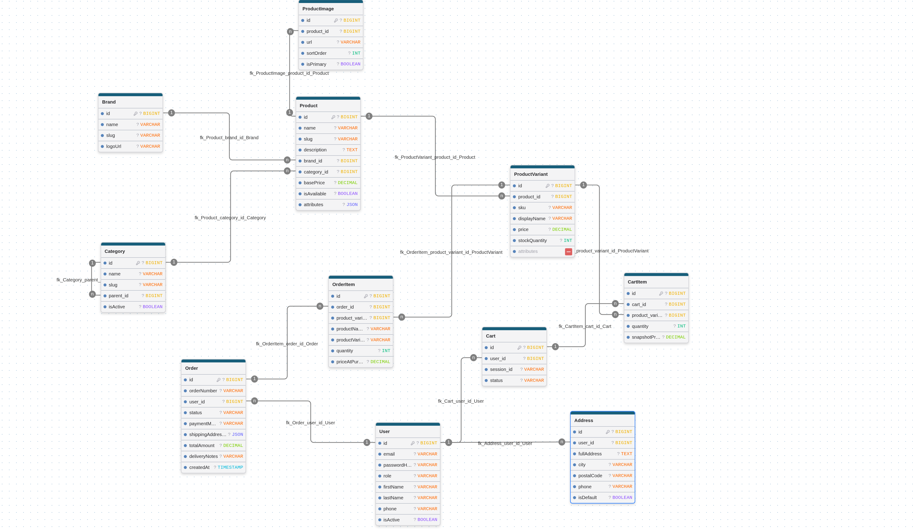

# 03-Domain-Model

# Domain Model

## Objectif

Ce document décrit le modèle métier de BeautyStor.

Le Domain Model représente les principales entités métier ainsi que leurs relations. Il sert de base à la conception de la base de données, des entités JPA et des API REST.

---

## Domaines

### Catalogue

- Category
- Brand
- Product
- ProductVariant
- ProductImage

### Utilisateurs

- User
- Address

### Vente

- Cart
- CartItem
- Order
- OrderItem

---

## Diagramme

---

## Remarques

- Les catégories sont hiérarchiques grâce à `parent_id`.
- Les produits peuvent posséder plusieurs images.
- Les variantes permettent de gérer différentes tailles, couleurs ou volumes.
- Les rôles des utilisateurs sont gérés via un Enum (`ADMIN`, `CUSTOMER`).
- Les informations essentielles d'une commande sont sauvegardées sous forme de snapshots afin de préserver l'historique même si les données changent par la suite.

---

## Statut

✅ Validé pour la Version 1
